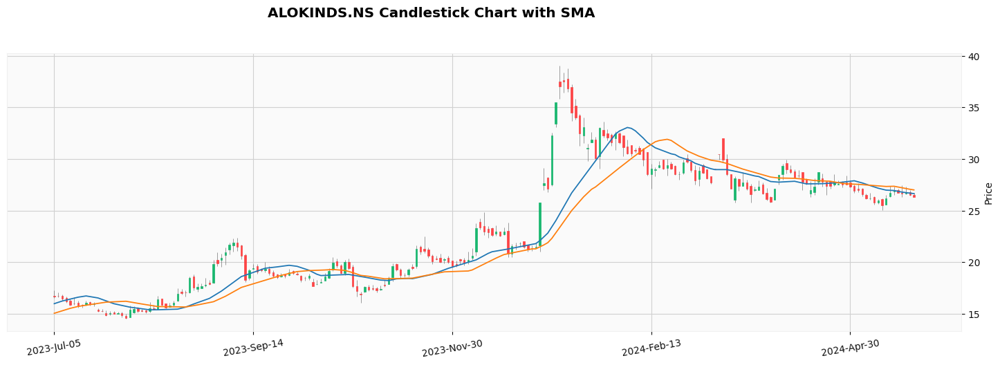

# Geospatial Toolset


Welcome to my repository of geospatial data science projects! This collection houses a variety of my data science and geospatial notebooks, algorithms, and python scripts, which serve as a testament to my proficiency and knowledge in this field. Each project showcases various facets of data analysis, machine learning, and visualization techniques.

A comprehensive, step-by-step guide on machine learning algorithms that can be implemented in Python and decode data science for practical applications. It also consisting of research on geospatial and machine learning toolsets and their application. This is an early development toolset, and is suitable for geospatial data analysis. Features and implementation are subject to change. 

This is also a Python library aims to simplify machine learning tasks and automate spatial and non-spatial data science projects. This library provides a comprehensive set of tools for Remote Sensing and GIS. By addressing the gaps in geospatial data processing tools and offering automation capabilities, this package proves to be an essential resource. Many of the tools are derived from scientific research articles, while others consist of efficient algorithms that enable streamlined processing with minimal code. With these tools, users or researchers can focus on analyzing their application results rather than spending time on coding or starting from scratch. This library is meant to be a resource for learning, growing, and sharing information about data science.

```tags```: python, data-science, jupyter-notebook, ipython-notebook, exploratory-analysis, geospatial, machine-learning, deep-learning

# [Get Datasets](https://github.com/dghorai/geospatial-toolset/blob/main/docs/Datasets.md)


# Projects

<table>
  <tbody align="center">
    <tr>
      <td>
        <a href="stock_price_forecasting.ipynb" target="_blank">
          <h4>Stock Price Forecasting</h4>
          
        </a>
        <p>It uses Yahoo Finance stock data to forecast stock prices using ARIMA and SARIMAX model. The EDA analysis and step-by-step implementation of these two models presented in Jupyter Notebook</p>
      </td>
      <td >
        <a href="" target="_blank">
          <h4>ArcGIS Python Scripts Examples</h4>
          
        </a>
        <p>Several Python scripts written using arcpy module for the purpose of learning. It helps us the use of arcpy module. An add-in button example also added to this repositary.</p>
      </td>
    </tr>
  </tbody>
</table>


# Installation

pip install git+https://github.com/dghorai/geospatial-toolset

# Contributing
We welcome contributions! If you wish to contribute to this repository, kindly adhere to the guidelines provided below. We greatly appreciate any enhancements, bug fixes, or additional projects.

- Fork the repository to your GitHub account
- Establish a fresh branch for your modifications or contributions
- Implement your alterations, improvements, or repairs in your branch
- Verify your modifications to guarantee they do not cause any problems
- Record your modifications with a concise and detailed commit message
- Upload/Push your modifications to your forked repository
- Finally, submit a pull request to the main repository


# Geospatial Analysis using Python and GIS Toolset

Chapter 1. Getting Started
1. Introduction
2. Start from here

Chapter 2. Learning Python for Geospatial Analysis
1. Basic of Python Language
2. Python packages for geospatial
3. Python packages for machine learning
4. Data Visualization

Chapter 3. Geospatial Toolset
1. Importing geospatial toolset modules
2. next...

### API Reference:
1. Classes
2. Functions
3. Modules
4. Extensions
